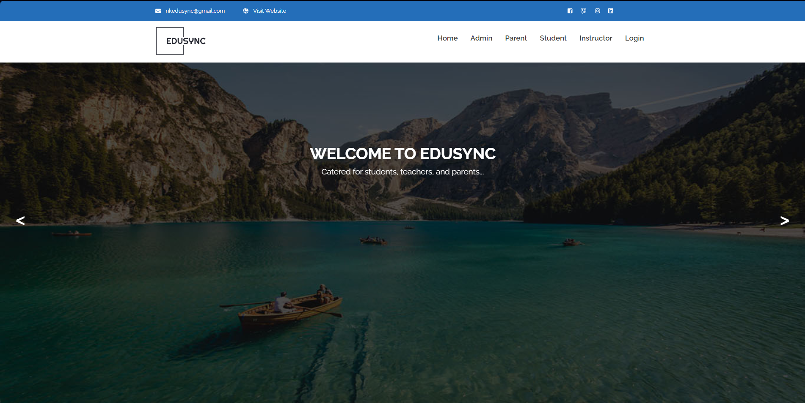
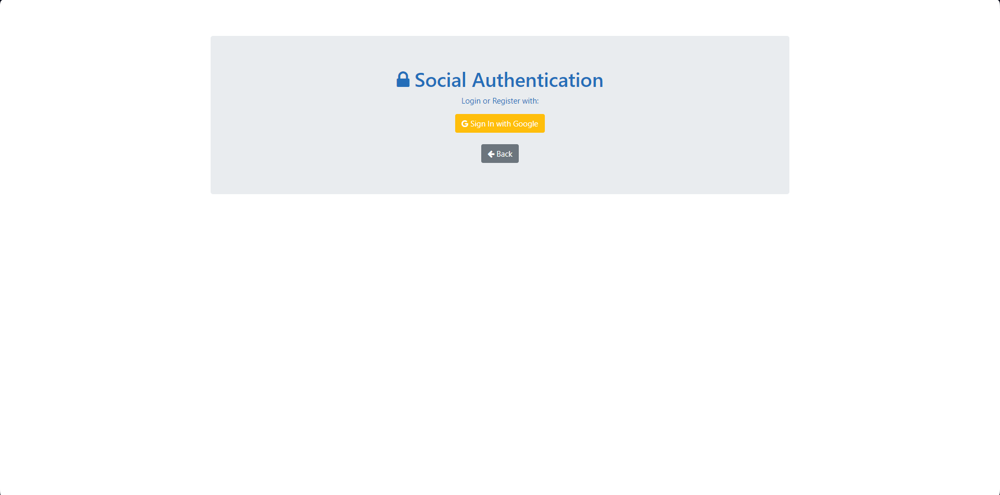
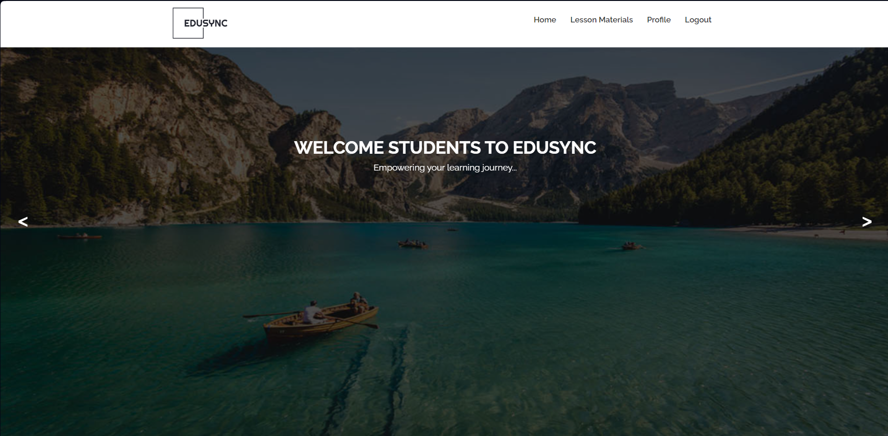
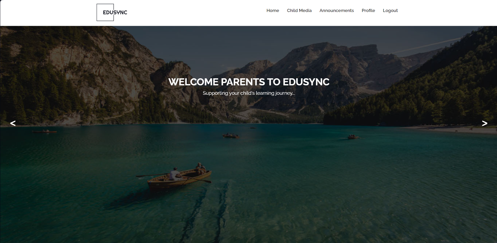
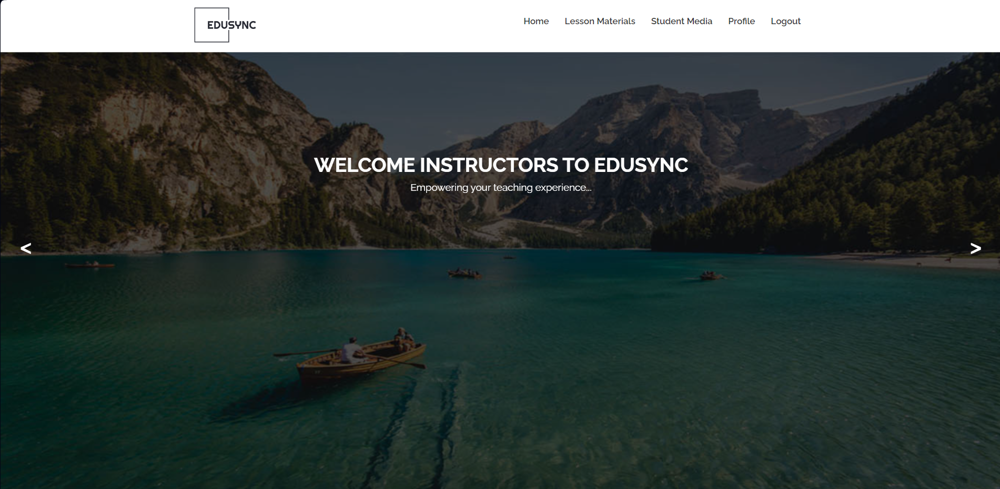
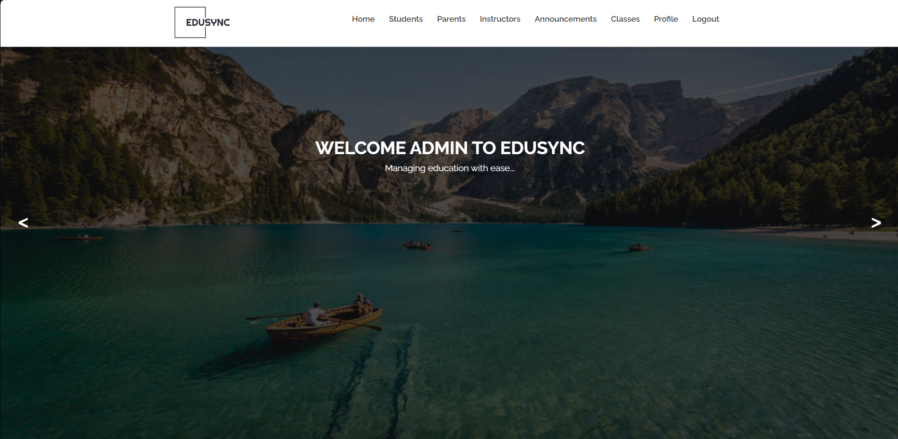

# EduSync

EduSync is a centralised web platform designed to streamline educational management processes at NK Robotics. It consolidates functionalities for lesson material storage and student media management into a single, secure, and user-friendly interface. The application provides tailored interfaces for students, parents, instructors, and admins, ensuring each user role has access to the specific tools and resources they need to enhance efficiency and improve the overall learning experience.

## Table of Contents 

- [Features](#features) 
- [Technologies Used](#technologies-used) 
- [Screenshots](#screenshots) 
- [Contributions](#contributions) 

## Features

- **Centralised Resource Management**: The application provides a unified platform for storing and accessing lesson materials and student media, eliminating the chaos of managing multiple file locations and platforms.

- **Role-Based User Interfaces**: Tailored interfaces for different user roles - students, parents, instructors, and admins - ensure that each user group has access to the tools and resources relevant to their needs. This design simplifies navigation and improves the user experience.

- **User-Friendly Platform**: The web application is built with a focus on the ease of use, ensuring that all users can navigate the platform efficiently.

## Technologies Used
- [Go](https://golang.org/) - A statically typed, compiled programming language.
- [HTML](https://developer.mozilla.org/en-US/docs/Web/HTML) - The standard markup language for creating web pages.
- [CSS](https://developer.mozilla.org/en-US/docs/Web/CSS) - A stylesheet language used to describe the presentation of a document written in HTML.

## Screenshots

### Homepage

### Login Page

### Student Page

### Parent Page

### Instructor Page

### Admin Page

## Contributions
Jiawei and Jeyvian from Ngee Ann Polytechnic, Diploma in Cybersecurity and Digital Forensics, for our capstone project in Year 3.1, with guidance from our capstone teacher, Mr Ben Low.
